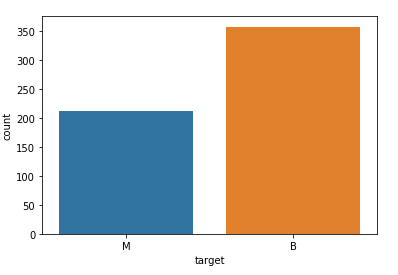
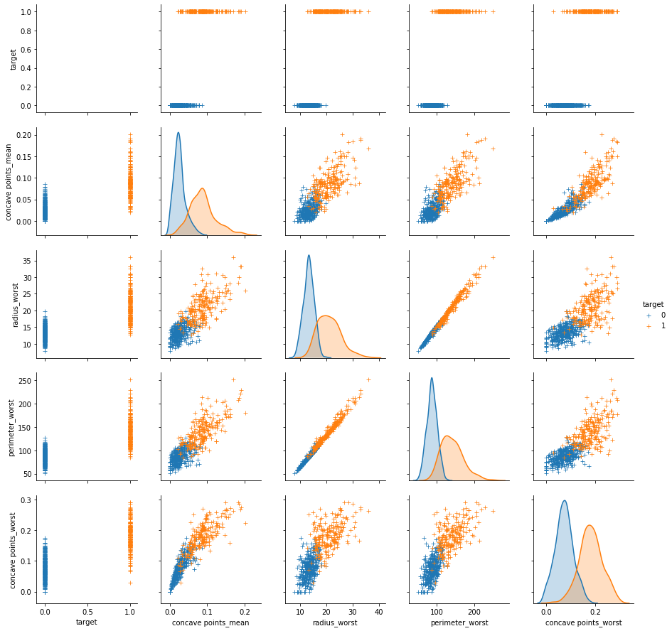
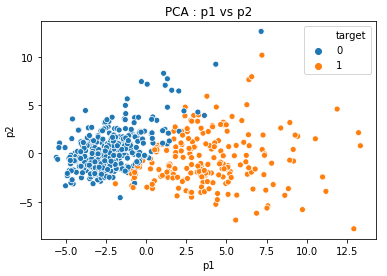
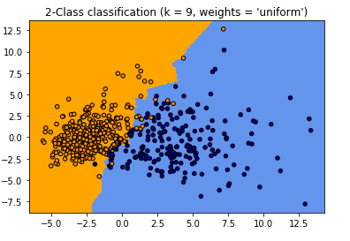
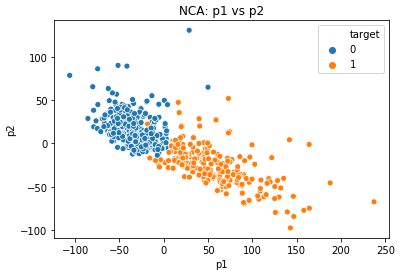
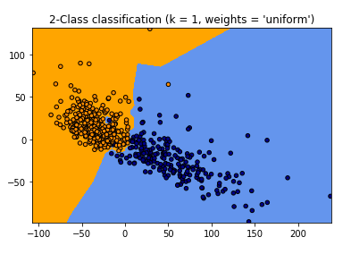
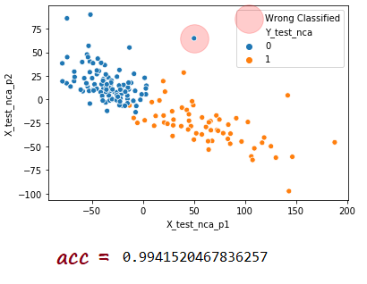

# Python-Breast-Cancer-Classification-Gogus-Kanseri-Siniflandirma
<strong>eng :</strong> Breast Cancer Classification --> The aim of the project, to determine whether the breast cancer cell is malignant or benign.I got the dataset from <a href="https://www.kaggle.com/uciml/breast-cancer-wisconsin-data">Kaggle</a>. It contains 596 rows and 32 columns of tumor shape and specifications. 
<strong>tr : </strong> Göğüs Kanseri Sınıflandırma --> Projenin amacı göğüs kanseri tanısı konulan kişilerde, tümörün iyi huylu mu - kötü
huylu mu olduğunu tespit etmektedir.Kullandığım verisetine buradan ulaşabilirsiniz :  <a href="https://www.kaggle.com/uciml/breast-cancer-wisconsin-data">Kaggle</a>.Veriseti tümörün şekili ve özeliklerini anlatan 596 satır ve 32 sütundan oluşmaktadır. 
</img> 
<strong>--> Correlation between features </strong>
</img> 
<strong>--> PCA </strong>
</img>
</img> 
<strong>--> NCA </strong>
</img>
</img> 
<strong>--> In The End  </strong>
</img>

